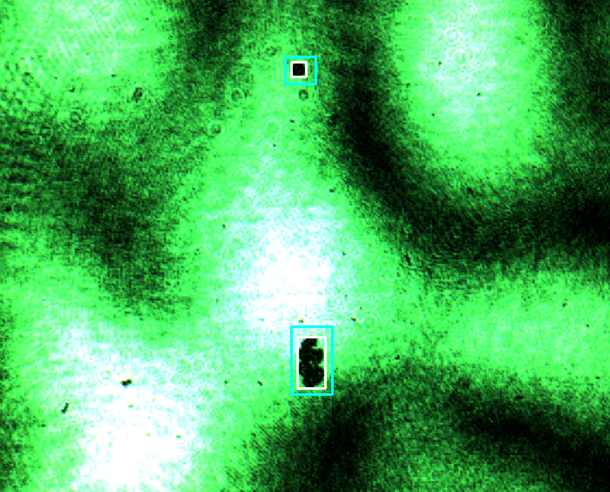
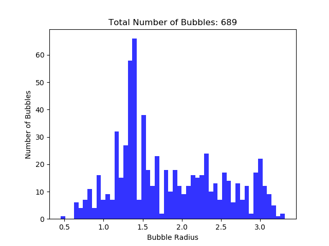

> Special thanks to Professor L. Jay Guo for advising our team
> and Dr. Qiaochu Li for supporting and approving our work.
> Project funded by Zhejiang University
> In affiliation with Optics & Photonics Laboratory - EECS @ Michigan

[View our report](Resources/Laser_Shadowgraphy_Image_and_Ultrasound_Signal_Feature_Extraction.pdf)

## What is Laser shadowgraphy?
Laser shadowgraphy is an **imaging technique** designed to capture non-uniformities in transparent media like air or water. Here, this technique is used to study the mechnism of *Photo-acoustic effect*, which is the formation of acoustic waves upon the absorption of modulated or pulsed light mainly through thermoplastic expansion.

## Our goal - Count the dark bubbles
The team at our lab has developed some sort of PA lens that can generate and focus densely powered ultrasonic waves strong enough to tear apart water molecules. To have a better insight into this phenomenon, we need to acquire data regarding the __quantity__ and __size__ of the bubble emerged during varied cavitation voltage.
<iframe width="560" height="315" src="https://www.youtube.com/embed/x5zLtLUOzrE" frameborder="0" allow="autoplay; encrypted-media" allowfullscreen></iframe>

## Gist of Ideas
- Image preprocessing - Denoising, Equalizing,
- Segmenting - Using modified KNN background segmentation algorithm
- Morphological Operations - Polishing the mask frame
- Overlapping detection - Using algorithm explained in the report
- Count and plot the result

###### [Download our report](Resources/Laser_Shadowgraphy_Image_and_Ultrasound_Signal_Feature_Extraction.pdf)

## Result
Demonstration of capturing bubbles

Count and plot bubble size distribution

## Running our code
#### Dependencies
- python 3.6
- pip install
  - opencv-python
  - Pillow
  - pypiwin32
  - matplotlib
  - tkinter

cd into current directory and type in `python xx.py` or just run `hello.bat`
`main.py` is the main tkinter application file.
All the algorithms and tools used are placed in `\MyDIPUtils\`

#### Interface
Look up help for instructions
Hit the button and pick up a video file to run.
Then select the region where there could be bubbles.
When finished, result will be shown as a histograph.

<a href="mailto:gyao961@gmail.com">Email me</a>
